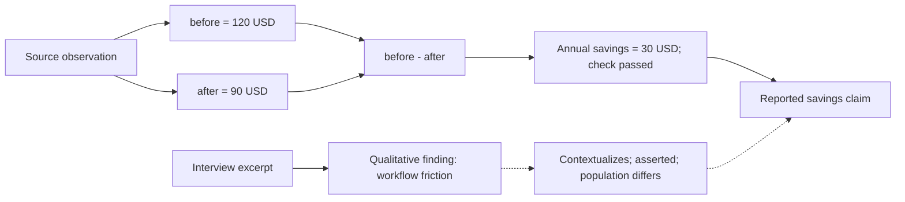

# research

Turn a research question into cited findings, reproducible calculations and a searchable record. The host agent chooses the research method; local Python tools validate contracts, compute results and preserve evidence in SQLite and Markdown.

Use this plugin when you need to compare options, investigate a claim, analyze supplied data or reuse previous research. You receive an answer with sources, calculation evidence where needed, and explicit gaps. Saving is optional.

## Start here

In a host with the plugin installed, ask:

```text
/research:research Compare these two plans using the supplied prices.
Calculate the annual savings, show the formula and validation, and do not save.
```

The agent should return a comparison, source-linked inputs and a computed savings result. It should ask for missing prices rather than invent them. Research routing does not itself execute the calculation; the host runs the selected tools.

For a coding agent working in this repository, use this handoff:

> Use the canonical research-plugin repository. Follow the installation instructions below for my host, then run the local routing smoke check. Report the selected route, calculation requirement, persistence setting and whether host loading was actually verified. Keep test data outside my research corpus.

To report a bug or request a feature: **`/research:submit-feedback`**.

## Install

### Python prerequisite

Use Python 3 with PyYAML in the environment that runs `research.py`:

```bash
python3 -m pip install pyyaml
# Optional symbolic verification:
python3 -m pip install sympy
```

### Claude Code

```
/plugin marketplace add tyroneross/research-plugin
/plugin install research@research-plugin
```

Restart Claude Code. The `/research:*` slash commands should autocomplete; the `research` skill activates on phrases like "research X", "investigate Y", "what's the current state of Z".

### Codex

Install from a configured Codex marketplace that points at this repository:

```bash
codex plugin add research@ross-labs-local
```

Codex loads the same plugin root: `.codex-plugin/plugin.json`, `commands/`, `skills/`, `hooks/`, `data/`, `vendor/omniparse/`, and `research.py`. Commands and skills resolve the runtime root from `RESEARCH_PLUGIN_ROOT`, `CLAUDE_PLUGIN_ROOT`, or `CODEX_PLUGIN_ROOT`.

## First run

When persistence is enabled, a `/research ...` session writes its markdown corpus to `~/dev/research/` and keeps its SQLite index there too. Or bootstrap explicitly:

```bash
python3 "${RESEARCH_PLUGIN_ROOT:-${CLAUDE_PLUGIN_ROOT:-${CODEX_PLUGIN_ROOT}}}/research.py" init
```

## Verify the local CLI

From the repository root, after installing Python and PyYAML:

```bash
python3 research.py route --query "Calculate annual savings; do not save" --json
```

Expected: `computation` is `required`, `persist` is `false`, and `status` is `planned`. This command writes no research data. It checks the CLI only; it does not prove that the host loaded the plugin or executed research. If Python reports a missing `yaml` module, install PyYAML in the same Python environment and retry.

## Roots

Examples use generic project paths. Machine-specific Build Loop state and personal workspace pointers are excluded from tracked plugin files; existing local state remains local.

The plugin now supports separate roots for content and derived index/state:

- `RESEARCH_CONTENT_DIR` — canonical markdown corpus, generated markdown views, archive, inbox, project symlinks
- `RESEARCH_INDEX_DIR` — SQLite DB, linked-project registry, verifier logs, extract cache
- `RESEARCH_BASE_DIR` — legacy compatibility alias; if the new vars are unset, both roots fall back here

Default behavior:

- content root: `~/dev/research/`
- index root: `~/dev/research/`

## Layout

Content root:

- `<content-root>/topics/<topic-tree>/<slug>.md` — canonical entries
- `<content-root>/indices/<topic>.md` — auto-generated Maps of Content
- `<content-root>/index.md`, `by-topic.md`, `by-tag.md`, `by-project.md`, `review-due.md`, `PORTFOLIO.md` — auto-generated dashboards
- `<content-root>/SOURCE-LEDGER.md` — source history across entries and runs
- `<content-root>/archive/` — archived entries (never deleted, redirect stubs left behind)
- `<content-root>/inbox/` — fleeting notes / files queued via `/research:ingest --inbox`
- `<content-root>/projects/` — project symlink views

Index root:

- `<index-root>/.db.sqlite3` — FTS5 index, domain scores, verifier state
- `<index-root>/.linked-projects.json` — linked external project registry
- `<index-root>/verifier-log/` — verification artifacts
- `<index-root>/calculation-receipts/` — append-only deterministic quantitative receipts
- `<index-root>/runs/` — vendor-neutral run contracts and worker packets
- `<index-root>/telemetry/hook-events.jsonl` — bounded local hook status records
- `<index-root>/.extract-cache/` — Omniparse extract cache

## Per-project research

Two mechanisms, depending on who authored the research.

**Plugin-authored entries** — when an entry's frontmatter includes `projects: [foo]` and a project directory exists, `/research:save` maintains a symlink at `<content-root>/projects/foo/<slug>.md` pointing to the canonical entry under `<content-root>/topics/`. The project directory is not modified. Pass `--with-project-index` if you also want a `<project>/RossLabs-Research.md` index file written into the project (opt-in).

**Pre-existing project research** — for directories like `~/projects/example-app/docs/research/` that predate this plugin and should not be restructured, use `/research:link-project <name> <path>`. The plugin walks the directory recursively for `*.md` files, extracts a title and a 1-line summary from each, records the registration in `<index-root>/.linked-projects.json`, and creates symlinks at `<content-root>/projects/<name>/<filename>`. The source directory is never modified.

Both mechanisms surface in `<content-root>/PORTFOLIO.md` under separate sections ("Plugin-managed projects" and "Linked external research directories"). `/research:index` refreshes both.

Legacy v0.3.0 artifacts (`<project>/research/` file copies, `<project>/research/.live/` symlinks, `<project>/RossLabs-Research.md`) are preserved as-is — v0.3.1 does not write to these paths by default, but also does not delete them. A one-time note is printed when the plugin touches a project that still has them.

## Subcommands

A 2026-08 surface reduction removed 27 thin slash-command wrappers. Every one of the underlying `research.py` subcommands is unchanged and still fully callable directly — the `research` skill itself already calls `research.py <subcommand>` via Bash rather than going through a slash command, so no capability was lost.

### Slash commands (13)

| Command | Purpose |
|---|---|
| `/research:research <topic>` | Router — run the full research flow: frame, source, execute, synthesize, deliver, persist |
| `/research:optimize <request>` | Turn a raw request into a claim-safe research contract: decision card, meta-questions, MECE sub-question groups, section contracts, 0-24 readiness score |
| `/research:extract <path>` | Route PDF/Excel/PPTX/Python/dir through vendored Omniparse and capture source-intake metadata |
| `/research:analyze-plan --input <path> --question "..."` | Generate a self-contained stdlib Python analysis plan/script |
| `/research:analyze-run --plan <analysis-plan.yaml>` | Run the generated analysis script and write results/audit artifacts |
| `/research:save <file>` | Persist an entry (Phase 6 entry point); writes canonical + project symlink, regenerates portfolio. `--with-project-index` to also write `<project>/RossLabs-Research.md` |
| `/research:link-project <name> <path>` | Register an existing external research directory (plugin does not modify it) |
| `/research:index` | Rebuild central indexes, refresh plugin-managed symlinks, re-scan linked external projects, and rewrite `PORTFOLIO.md` |
| `/research:search <query>` | FTS5-ranked plain-text search across canonical entries and linked external project files. Use `--fts-query` for raw FTS5 syntax or `--entries-only` to exclude linked files |
| `/research:ingest <path>` | Bulk-ingest existing markdown files; `--inbox` to park, `--save` to persist drafts |
| `/research:table-profile <path>` | Profile CSV/TSV/JSON data before quantitative analysis |
| `/research:db-profile <path>` | Profile a SQLite database schema, row counts, indexes, and foreign keys |
| `/research:submit-feedback` | Report a bug or request a feature — drafts a GitHub issue on `tyroneross/research-plugin`, files it only after you approve |

### Direct `research.py` subcommands (no slash wrapper)

Invoke as `python3 "${RESEARCH_PLUGIN_ROOT:-${CLAUDE_PLUGIN_ROOT:-${CODEX_PLUGIN_ROOT}}}/research.py" <subcommand>`, or load the `research` skill and let it invoke these via Bash.

| Subcommand | Purpose |
|---|---|
| `init` | Bootstrap the configured content and index roots |
| `route --query <request> --json` | Suggest a tentative route; use `--request-file <request.json>` to validate host classification and explicit user overrides |
| `depth <query>` | Legacy-compatible light/standard/deep guidance, independent of no-save instructions |
| `list [N]` | Recent entries |
| `link <slug>` | Retroactive project symlink for a saved entry |
| `sync` | Rebuild SQLite from canonical topic markdown; use `--prune-missing` after moves or migrations |
| `recategorize` | Suggest splits for top-level topics that have grown too large (read-only) |
| `archive <slug>` | Move to archive, leave redirect stub |
| `score <url>` | Inspect or set source tier for a domain |
| `verify <slug>` | Run claim verification on an entry |
| `calculate --spec <path>` | Execute a deterministic formula with source-linked inputs and append a quantitative receipt |
| `doctor` | Audit event-chain integrity, index parity, provenance coverage, malformed entries, and duplicate slugs |
| `doctor-plan` | Produce a hashed, plan-only remediation sequence from doctor findings without applying corpus changes |
| `source-record --manifest <path>` | Append one host-fetched or locally extracted source representation |
| `source-index` | Rebuild the overall source ledger and central per-project indexes |
| `legacy-source-import [--apply]` | Dry-run, then normalize past entry source lists while preserving unknown provenance |
| `trust-record --manifest <path>` | Append dated, topic-scoped trust observations with evidence links |
| `graph-export` | Export evidence dependencies with input numbers, formulas, results, validation status and correction links as Mermaid or JSON |
| `traversal-record --manifest <path>` | Enforce a run's bounded deep-link policy and append accepted/rejected frontier decisions |
| `run-init --contract <path>` | Validate a vendor-neutral run contract and emit disjoint worker packets |
| `run-validate --contract <path>` | Validate a run contract without initializing it |
| `run-merge --contract <path> --result <path>... [--reconciliation <path>]` | Validate evidence coverage, calculation receipts, and append-only contradiction reconciliation before synthesis |
| `run-stage --run-id <id> --span-id <id> --stage <name> --action start\|finish` | Append vendor-neutral stage timing, measured counters, and artifact-bound worker receipts |
| `run-metrics --run-id <id>` | Calculate declared-span overlap, interval unions, launch spread, worker-to-merge gap, total pipeline idle, and merge time without treating staggered dispatch as handoff delay |
| `eval-check --root <path>` | Verify bounded control files, hashes, artifact references, query coverage, and independently attested audits in an external frozen evaluation corpus |
| `review` | Surface stale / review-due entries |
| `compress <slug>` | Compact an entry's TL;DR and Raw sections |

`/research:dashboard` had no `research.py` equivalent even before removal — its capability lives entirely in the `audit-dashboard` skill. Load that skill, or run directly: `python3 skills/audit-dashboard/scripts/render_dashboard.py <audit.json> --out <file.html>` (`--validate-only` checks the payload without rendering).

## Search

`/research:search` defaults to safe plain-text search: punctuation-heavy terms such as `research-plugin` are quoted before they reach FTS5, and results include highlighted snippets. Canonical entries and linked external project files are searched together unless `--entries-only` is passed. Raw FTS5 syntax remains available with `--fts-query` for advanced queries.

## Research paths

The host agent chooses the method from the user's intended outcome. The Python router validates that choice and returns a reviewable receipt; it does not call a model, launch agents, or execute research.

- **Task shape:** lookup, compare, survey, explain or collect.
- **Research method:** review, qualitative, measurement, causal, forecast, simulation, hypothesis, experiment, optimize, formal or archival. Methods can form ordered stages.
- **Independent controls:** depth, domain, verification, permitted sources, computation, execution permission and persistence.

Psychology does not always route to one architecture: interview themes use qualitative analysis; scale validity uses measurement; intervention effects use causal analysis. Economics can use forecasting or simulation. Engineering can use optimization or formal verification. Each method carries required inputs and completion evidence.

```bash
python3 research.py route --query "Compare the options; calculate percentage savings; do not save" --json
python3 research.py route --request-file request.json --json
```

A structured request separates host classification from explicit user overrides:

```json
{
  "query": "Estimate the intervention's causal effect from the supplied data",
  "task_shape": "explain",
  "methods": ["causal"],
  "domain": "economics",
  "available_capabilities": ["python"],
  "overrides": {"depth": "standard", "source_policy": "supplied", "persist": false, "allowed_execution": "local"}
}
```

Explicit overrides win. Raw-query classification is deliberately tentative. A receipt can be `planned` or `blocked_missing_input`; it never establishes that a calculation, experiment or proof has run. Capability availability does not establish permission, input readiness or validity.

The four core structures are a single loop, a dependency pipeline, bounded fan-out with merge, and an evaluation loop. Fan-out requires declared independent tasks and permission to use agents. Missing simulators, experimental executors or proof checkers produce a method plan and a capability gap. See the [routing contract and method profiles](skills/research/references/method-routing.md) and [disciplinary evidence assessment](docs/proposals/2026-09-07-discipline-research-methods.md) for method requirements and the limits of published architecture evidence.

## Quantitative analysis: scripts compute and validate

Agents must use an existing calculation tool or write and execute a reviewed Python script for derived numbers, including calculations embedded in otherwise qualitative reports.

1. Use `calculate --spec <spec.json>` for supported formulas with registered source observations.
2. Use `table-profile` / `db-profile`, then `analyze-plan` / `analyze-run` for structured inputs. The generated script is a profiling scaffold; it does not implement the user's custom analysis automatically.
3. Write a reviewed Python script for complex estimators, simulations or unsupported formulas. Prefer stdlib or suitable preinstalled scientific libraries; record dependencies and versions.
4. Preserve input provenance, units, formula/query, script/spec hash, executed results and validation checks. Complex work needs reference cases or an independent calculation, plus sensitivity or numerical checks where relevant.

Reports distinguish source-quoted values, validated computations, unvalidated computations, estimates and inconclusive results. A successful process exit alone does not validate the assumptions or answer the question. No execution means no claim of a calculated result. See [quantitative analysis](skills/research/references/quantitative-analysis.md).

## Connect financial, quantitative and qualitative evidence

Use one evidence graph to connect financial metrics, calculated results and qualitative findings. Claims can `support`, `contextualize` or `qualify` other claims through explicit source-backed assertions. Each connection records its rationale and whether entity, period, population and measure align. Contradictions remain separate and visible.

The agent proposes these connections; the CLI validates references and structure. A connection is not causal proof, and interview themes are not automatically converted into financial estimates. See the [mixed-evidence contract](skills/research-orchestrator/references/contracts.md#connect-financial-quantitative-and-qualitative-evidence).

After recording sources, running `calculate` and merging claim connections with `run-merge`, export the run:

```bash
python3 research.py graph-export --run-id example-run --output evidence.md
python3 research.py graph-export --run-id example-run --format json --output evidence.json
```

Replace `example-run` with the run ID used by your calculation receipts. Mermaid output displays input values, results, formulas, output units, denominators, grain and recorded validation status. JSON also includes calculation details and checks. Input values link to source observations; corrections link to previous receipts. Existing receipts gain these views without a migration.

Illustrative calculation, not a measured research finding:



The export follows dependency arrows from claims toward calculations and sources. A recorded `passed` check is not an independent audit; use `doctor` to verify stored receipt integrity. Failed and inconclusive calculations remain visible. This is an evidence graph, not a charting engine. See [quantitative analysis](skills/research/references/quantitative-analysis.md).

## Research depth

`research.py depth` (no slash wrapper — retained for direct scope guidance) is a deterministic pre-flight classifier for choosing scope. It returns `light`, `standard`, or `deep`, plus source budget, coverage requirements, workflow, web requirement, persistence guidance, and rationale.

- `light` — quick answer, usually 0-2 sources, skip persistence unless reusable.
- `standard` — bounded research, usually 3-8 sources with a target of 5, persist when the answer becomes report-sized.
- `deep` — decision-grade or explicitly thorough/expansive research, usually 7-15 sources with a target of 10, verify and persist by default.

Standard and deep runs plan source coverage before fetching: primary/original sources, independent corroboration, counter-evidence, temporal/currentness checks, and explicit gaps. The goal is wider evidence coverage plus source-faithful extraction, not shallow source-count padding.

For expansive deep research, the skill now includes a deep research architecture overlay: deterministic intake, parser routing, normalized evidence records, search/fetch-style source access, and QA gates for claim support and citation precision. See `skills/research/references/deep-research-architecture.md`.

## Vendored dependencies

`/research:extract` routes document parsing (PDF, Excel, PPTX, Python, directories) through a self-contained, pre-built copy of `@tyroneross/omniparse` that ships with this plugin at `vendor/omniparse/`. All JS runtime deps are inlined — no `npm install` needed. Only `node >= 18` must be on PATH.

- Upstream: https://github.com/tyroneross/Omniparse (see `vendor/omniparse/.upstream` for the exact commit)
- License: FSL-1.1-MIT (copied verbatim to `vendor/omniparse/LICENSE`)
- Re-vendor: follow `vendor/omniparse/BUILD.md`

A user-installed `omniparse` on `PATH` will be preferred over the vendored copy when present.

## Philosophy

- **Non-LLM parsers first, LLM for judgment** — the host agent's WebFetch/Read tools and vendored parsers extract content; scripts compute what can be computed.
- **Parse first, reason second** — mixed files become normalized evidence with provenance and extraction confidence before synthesis.
- **Code does the math** — a quantitative fact requires a passed local receipt with formula/query, units, denominator, grain, assumptions, source observations, hashes, runtime, result, and checks. Ambiguity is inconclusive.
- **Host-neutral orchestration** — skills describe roles and task contracts; Codex, Claude Code, or another host supplies agents and browser capabilities without becoming a runtime dependency.
- **Research stays outside plugin git** — code, skills, schemas, and synthetic fixtures live here; entries, captures, task packets, receipts, indexes, and local telemetry use the configured research roots.
- **Deterministic over clever** — same URL always scores the same tier; same claim always routes to the same verifier.
- **Never delete** — archive + redirect stubs preserve all inbound links.
- **Three layers** — TL;DR (≤150 words, extractive), Notes (bolded key passages + citations), Raw (verbatim source excerpts for future verification).

## Plugin surface

The repository root is the package root for both hosts.

- Claude Code manifest: `.claude-plugin/plugin.json`
- Codex manifest: `.codex-plugin/plugin.json`
- Slash commands: `commands/*.md`
- Skills: `skills/research/SKILL.md`, `skills/research-orchestrator/SKILL.md`
- Advisory hook: `hooks/hooks.json`
- Runtime: `research.py`
